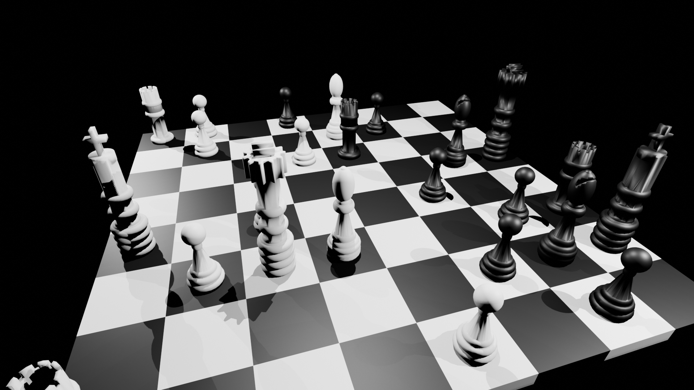

# chess2vid

Small project that generates video frames (png) out of chess games (in pgn), so it could have been called pgn2png.

## Overview of the project

This project loads the pgn game from the file and generates 30 frames per move of the game. It does this by using the blender API to generate objects and animations. The resulting blender file and be saved and used independently, to investigate what was done, change something, etc.

## Install

`poetry install`

## The blender situation

The packaged blender on my linux (LMDE 6) is quite old (3.4) and this project requires 4.x, so I had to download blender from https://www.blender.org/download/ and use the `--blender-bin` flag pointing to this installation's `blender` binary.

## Usage

`chess2vid [-h] [-fw FRAME_WIDTH] [-fh FRAME_HEIGHT] -i INPUT_GAME [-b BLENDER_BIN] [-o OUTPUT_PATH] [-stl STL_PATH] [-s SAVE_BLENDER] [-r RENDER_FRAMES [-v]`

## How to generate frames

Warning: Rendering takes a long time!

`poetry run chess2vid --input-game my-game.pgn --save-blender my-game.blend --output-path ./my-game-frames --render-frames 1:`

## How to generate a video out of the frames

Once the frames are generated, go to that path (i.e: `cd my-game-frames`) and run:

`../make_video.sh`

The resulting video will be called output.mp4

## Parallel execution

Given rendering takes a lot of time, you can run the rendering in different machines, dividing the workload. Let's assume a complete game requires about 2000 frames and we have 3 computers, we could run the following:

In computer #1
`poetry run chess2vid --input-game my-game.pgn --output-path ./my-game-frames --render-frames 1:700`

In computer #2
`poetry run chess2vid --input-game my-game.pgn --output-path ./my-game-frames --render-frames 701:1400`

In computer #3
`poetry run chess2vid --input-game my-game.pgn --output-path ./my-game-frames --render-frames 1401:`

Then we can merge the resulting frames in a single path and generate the video

### Sample frame

